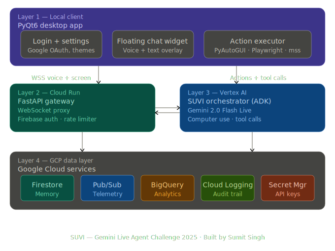

# SUVI 

> **Empowering Accessibility through AI:** A next-generation multimodal desktop assistant built for the **Google Gemini Live Agent Challenge**. 


##  The Vision & Inspiration
SUVI was born out of a profound need for **digital accessibility**. For individuals with physical disabilities—such as those without the use of their hands or with severe mobility impairments—interacting with standard computers can be an insurmountable challenge. 

**My vision for SUVI is to bridge this gap.** By combining real-time, natural voice conversation with advanced computer vision and autonomous UI control, SUVI acts as a virtual pair of hands. A user can simply speak naturally to their computer ("Hey SUVI, please open my email and write a message to Mom saying I will be late"), and SUVI will visually navigate the screen, type, click, and complete the task—all while conversing with the user seamlessly.

---

##  Demonstration Video
*(Hackathon Judges: Please watch this demo to see SUVI in action!)*

[](#)
*(Insert YouTube Link Here)*

---

## 🚀 Hackathon Challenge Alignment
SUVI breaks the "Text Box" paradigm and perfectly aligns with two primary tracks of the challenge:
1. **Live Agents:** Utilizes the `gemini-2.5-flash-native-audio` model for real-time, low-latency, interruptible voice interactions.
2. **UI Navigator:** Employs the `gemini-2.5-computer-use-preview` model to observe screen state via screenshots and execute complex UI navigation paths (clicks, scrolls, typing) autonomously.

### Mandatory Tech Used:
* **Models:** Gemini 2.5 Flash Native Audio, Gemini 2.5 Computer Use, Gemini 3.1 Pro (Orchestrator).
* **SDK:** Built using the `google-genai` and `google-adk` libraries.
* **Hosting/GCP:** The system backend is deployed on **Google Cloud Run** ([Live Gateway URL](https://suvi-google-gemini-live-hackathon-722150734142.us-central1.run.app)). It heavily utilizes Google Cloud services including **Firestore**, **Cloud Logging**, and **Secret Manager**.

---

## 🧠 System Architecture



SUVI operates on a sophisticated **Multi-Agent Architecture** divided into a Desktop Client and a GCP Cloud Gateway:

1. **Layer 1: Local Client (PyQt6)**
   * Manages local microphone input and speaker output.
   * Houses background workers for wake-word detection ("Hey SUVI").
   * Connects to the GCP Gateway via secure WebSockets.
   * Runs the local execution engines (`PyAutoGUI`, `Playwright`) to physically move the mouse and type keys on the user's machine.

2. **Layer 2 & 3: Cloud Run Gateway + Vertex AI (Orchestration & Intelligence)**
   * **Live Agent (`live_session.py`):** Handles the real-time voice stream. It recognizes intents.
   * **Orchestrator Agent (`agents/orchestrator`):** If a user asks for a desktop task, the Orchestrator (powered by Gemini Pro) creates a step-by-step plan.
   * **Computer Use Agent (`computer_use_service.py`):** Executes the plan in a continuous loop. It asks the local client for a screenshot, analyzes it using Gemini Computer Use, determines the next UI action (e.g., "Click at x:100, y:200"), and dispatches the command back to Layer 1.

3. **Layer 4: GCP Data Layer**
   * Firestore manages long-term user memory and session state.
   * Cloud Logging provides audit trails for automated actions.

---

## 🛠️ Spin-Up Instructions (How to Run Locally)

To evaluate SUVI, you will need to run the Desktop Client locally on your Windows machine, as it requires physical access to your screen, mouse, and keyboard.

### Prerequisites
* Windows 10/11
* Python 3.10 or higher
* A valid Google Cloud Project with the Vertex AI API and Live API enabled.

### 1. Clone the Repository
```bash
git clone https://github.com/your-username/suvi.git
cd suvi
```

### 2. Set Up the Desktop Client
```bash
cd apps/desktop
python -m venv venv
venv\Scripts\activate
pip install -r requirements.txt
```

### 3. Environment Variables
Create a `.env` file in the `apps/desktop/` directory and add your Google credentials:
*(Note: You must have a GCP Service Account JSON key)*
```env
GOOGLE_APPLICATION_CREDENTIALS="C:\path\to\your\service_account.json"
PROJECT_ID="your-gcp-project-id"
LOCATION="us-central1"
GATEWAY_URL="wss://suvi-google-gemini-live-hackathon-722150734142.us-central1.run.app"
```

### 4. Launch the App
```bash
python -m suvi
```
*   The SUVI chat widget will appear on your desktop.
*   You can click the microphone icon or say "Hey SUVI" (if enabled) to start talking!

---

## 🔮 Future Plans
While SUVI was built for this hackathon, the journey doesn't end here. Future iterations will include:
*   **Cross-Platform Support:** Expanding from Windows to macOS and Linux desktop environments.
*   **Mobile Companion App:** Allowing users to control their desktop remotely via voice from their phone.
*   **Advanced Safety Rails:** Implementing stricter bounding boxes and visual confirmation prompts for highly sensitive actions (e.g., deleting files, sending financial emails) to ensure absolute safety for visually or physically impaired users.
*   **Custom Persona Tuning:** Allowing users to define SUVI's voice tone, speaking speed, and verbosity to better match their personal accessibility needs.

---

## 🤝 Acknowledgments
* Google GenAI Team for the incredible Gemini 2.5 Live and Computer Use APIs.
* Built with ❤️ by Sumit Singh for the Gemini Live Agent Challenge 2026.
